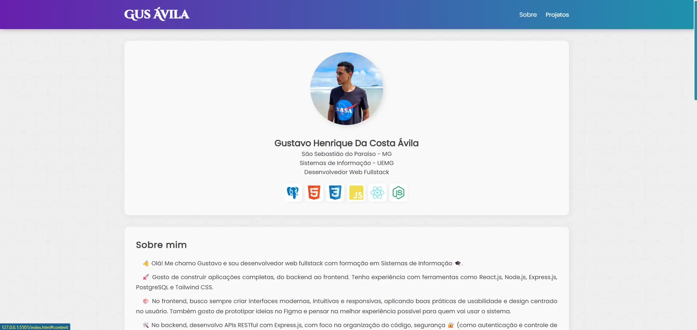

# Portfólio Pessoal - Gustavo Ávila

Bem-vindo ao meu portfólio pessoal! Este projeto foi criado para apresentar minhas habilidades, certificações e projetos desenvolvidos como desenvolvedor web fullstack.

## 📸 Pré-visualização



## 📌 Sobre o Projeto

Este portfólio foi desenvolvido com foco em responsividade, usabilidade e uma estética moderna. Ele reúne:

- Informações pessoais e biografia profissional
- Certificações e cursos realizados
- Idiomas que domino
- Uma vitrine de projetos, com prévias e links para o GitHub e/ou deploys públicos
- Ícones de tecnologias utilizados no dia a dia
- Links para redes sociais

## 💻 Tecnologias Utilizadas

- **HTML5**
- **CSS3** (com uso de variáveis, animações e media queries)
- **JavaScript** (para funcionalidades interativas)
- **Responsividade** via `media queries`
- **Animações** com `@keyframes`
- **Fontes personalizadas** com `@import`

## 🎨 Layout e Estilo

- **Design responsivo**: adaptado para dispositivos móveis
- **Paleta de cores**: baseada em tons de roxo e ciano, proporcionando contraste e modernidade
- **Carousel de tecnologias**: animação contínua com ícones das principais stacks
- **Cards interativos**: com efeito `hover` e transições suaves

## 📂 Estrutura de Pastas

```
├── index.html
├── assets/
│   ├── css/
│   │   ├── style.css
│   │   └── fonts.css
│   ├── imagens/
│   │   └── [fotos de perfil e prévias dos projetos]
│   ├── javascript/
│   │   └── script.js
│   ├── favicon.ico
├── cursos/
│   └── [PDFs de certificados]
```

## 🧠 Conteúdo

### Sobre Mim
Apresentação pessoal, formação em Sistemas de Informação (UEMG), experiência com tecnologias como React, Node.js, Express.js, PostgreSQL, entre outras.

### Idiomas
- **Português**: fluente
- **Inglês**: avançado (nível C1)

### Certificações
Inclui cursos como:
- Arquitetura de Redes
- AWS - Computação em Nuvem
- Figma Essential Training
- UX Foundations
- Marketing Digital (Google)
- Marketing Analytics (Meta)
- WordPress, Copywriting, entre outros

### Projetos em Destaque
- **Fullstack Todo List**: sistema de tarefas com autenticação
- **Family Travel Tracker**: controle de viagens em família
- **TechNews Landing Page**: landing page para uma newsletter de tecnologia

### Outros Projetos
Inclui projetos como:
- Simon Game
- Dice Game
- Tindog
- Sistema de Cadastro (CRUD)
- Capital Quiz
- Diário
- Projeto Android
- e outros...

### Redes Sociais
Links com badges personalizados para:
- GitHub
- LinkedIn
- Instagram
- Twitter
- Facebook
- YouTube

## 🔗 Acesse

- **Portfólio online**: [gusavila.github.io](https://gusavila.github.io/portifolio/)
- **GitHub**: [github.com/gusavila](https://github.com/gusavila)

## 📅 Atualizado

Este portfólio foi atualizado em **2025** e continuará evoluindo com novos projetos e certificações.

## 🧾 Licença

Este projeto é de uso pessoal. Sinta-se à vontade para se inspirar, mas não copie diretamente sem créditos.